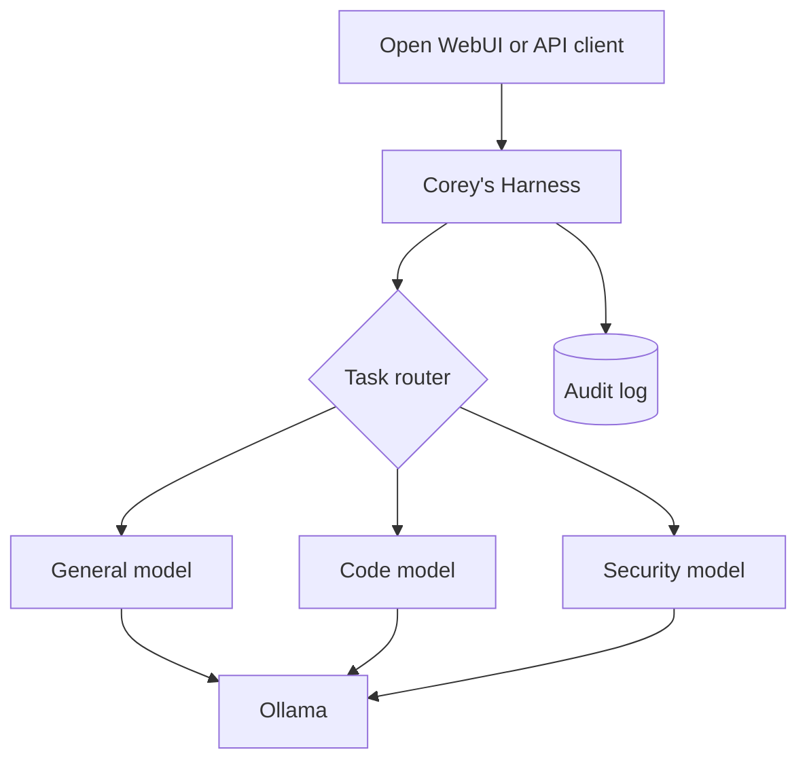

# Corey's Harness

**Current release: v0.1.0 Public Preview**

Corey's Harness is a local-first routing and governance layer for Open WebUI and Ollama, developed by Skylinee LLC. It presents an OpenAI-compatible API, selects a locally installed model based on the task, keeps a metadata-focused audit trail, and enforces an advisory-only policy.

This public preview is intended for local labs, evaluation, and development. It is not a fully autonomous agent and should not be treated as a security control.

## What v0.1.0 includes

- OpenAI-compatible `GET /v1/models` and `POST /v1/chat/completions` endpoints.
- Automatic routing for general, coding, and security requests.
- Manual route aliases for predictable model selection.
- Normal and streaming chat completions.
- An advisory-only policy message added to every request.
- Explicit rejection of tool execution instead of pretending a tool ran.
- Metadata-only JSONL audit records by default; prompt text is not stored.
- Optional bearer-key authentication.
- Docker Compose deployment and a local Python development workflow.

## What v0.1.0 does not include

- Web search or browser automation.
- Arbitrary shell or Python execution.
- Automatic firewall, account, or file changes.
- A write-capable tool registry or approval queue.
- A guarantee of production readiness.

Web search is planned for v0.2.0 using a read-only, provider-configurable design. See [ROADMAP.md](ROADMAP.md) for planned versions.

## Architecture



## Quick start with Docker

Prerequisites: Docker Compose and an accessible Ollama instance with the configured models already pulled.

1. Copy the environment template and set a strong API key.

   ```bash
   cp .env.example .env
   ```

2. If Ollama is on another machine, change `SKYLINEE_OLLAMA_BASE_URL` in `.env`, for example:

   ```text
   SKYLINEE_OLLAMA_BASE_URL=http://192.168.1.50:11434
   ```

3. Start the harness.

   ```bash
   docker compose up -d --build
   ```

4. Confirm it is healthy and check the running version.

   ```bash
   curl http://127.0.0.1:8000/healthz
   ```

5. Preview a route without generating a response.

   ```bash
   curl http://127.0.0.1:8000/v1/routes/preview \
     -H "Authorization: Bearer YOUR_KEY" \
     -H "Content-Type: application/json" \
     -d '{"model":"skylinee-auto","messages":[{"role":"user","content":"Summarize this Sysmon alert"}]}'
   ```

## Connect Open WebUI

Add an OpenAI-compatible connection in Open WebUI with:

- Base URL: `http://HOST_RUNNING_THE_HARNESS:8000/v1`
- API key: the value of `SKYLINEE_API_KEY`
- Model: `skylinee-auto`

The model list also exposes `skylinee-general`, `skylinee-code`, and `skylinee-security` for manual overrides. If Open WebUI runs in Docker on the same machine, use a Docker-reachable hostname instead of `127.0.0.1`.

The Compose file binds the harness to localhost by default. Change the port mapping only after firewalling the service and setting a strong API key.

## Run locally for development

```bash
python -m venv .venv
source .venv/bin/activate
pip install -e '.[dev]'
uvicorn skylinee_harness.main:app --reload
```

Run checks:

```bash
ruff check .
pytest
```

## Routing behavior

`skylinee-auto` uses deterministic keyword scoring so routing decisions remain inspectable and testable. Security wins a tie with coding; an explicit route alias always overrides automatic routing. Model names are configured through environment variables, so routing can evolve without changing Open WebUI.

## Audit behavior

Each request records its ID, timestamp, selected route, model, reason, outcome, latency, and a SHA-256 fingerprint of the request. Prompt content is excluded unless `SKYLINEE_LOG_PROMPT_CONTENT=true` is explicitly set.

## Security and responsible use

Keep the default localhost binding unless remote access is required. Always use a strong API key before exposing the service, protect Ollama from direct public access, and review the audit-log configuration before processing sensitive prompts. See [SECURITY.md](SECURITY.md) for reporting and deployment guidance.

## Project documents

- [ROADMAP.md](ROADMAP.md) — planned versions and tools.
- [CHANGELOG.md](CHANGELOG.md) — release history.
- [CONTRIBUTING.md](CONTRIBUTING.md) — development and contribution workflow.
- [SECURITY.md](SECURITY.md) — vulnerability reporting and safe deployment notes.

## License

Copyright 2026 Skylinee LLC. Licensed under the [Apache License 2.0](LICENSE).
